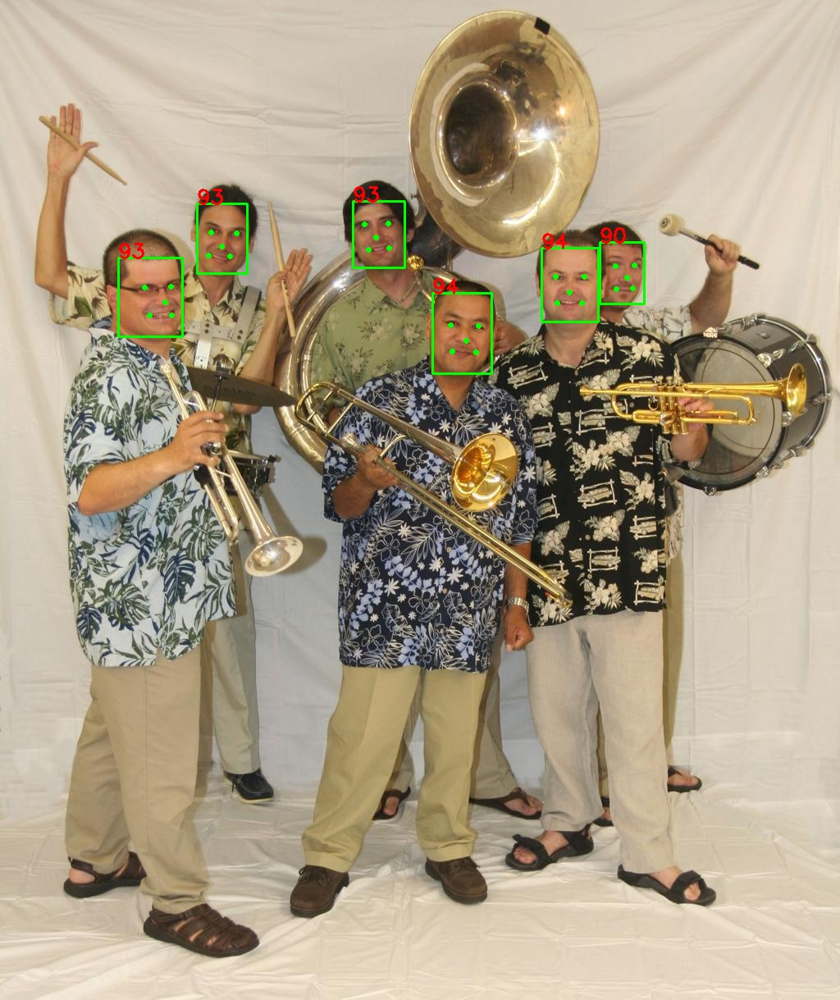

<!-- ```shell
pip install cibuildwheel
cibuildwheel --platform linux

twine upload --repository testpypi dist/*.gz
pip install -i https://test.pypi.org/simple/ yudet==0.0.1
pip install ./dist/yudet-0.0.1.tar.gz
``` -->

<!-- ## Cross build toolchains:
* x86_64-linux: \
https://toolchains.bootlin.com/downloads/releases/toolchains/x86-64/tarballs/x86-64--glibc--stable-2022.08-1.tar.bz2\
* aarch64: \
https://toolchains.bootlin.com/downloads/releases/toolchains/aarch64/tarballs/aarch64--glibc--stable-2022.08-1.tar.bz2\
* armv7-eabihf:\
https://toolchains.bootlin.com/downloads/releases/toolchains/armv7-eabihf/tarballs/armv7-eabihf--glibc--stable-2022.08-1.tar.bz2 -->


# Introduction 
A super fast face detector packaged by the [libfacedetection](https://github.com/ShiqiYu/libfacedetection) repository using pybind11.
# Change Log
## 2023-5-8
Project init

## Quick start
```shell
pip install yudet
```

## Usage
1. Load image
```python
# opencv
import cv2
img = cv2.imread('xxx.jpg')

# PIL
import PIL
import numpy as np
img = PIL.Image.open('xxx.jpg').convert('RGB')
img = np.array(img)                             # convert to numpy array
img = img[:, :, ::-1]                           # convert to BGR

# imageio
import imageio as io
img = io.imread('xxx.jpg')
img = img[:, :, ::-1]                           # convert to BGR
```
2. Detect
```python
# img: numpy.ndarray, shape=(H, W, 3), dtype=uint8, BGR
# conf_thresh: float, confidence threshold, default=50, range=[0, 100]
from yudet import detect
confs, bboxes, landmarks = detect(img, conf_thresh=50)
```
3. Deal result
```python
# confs: numpy.ndarray, shape=(N,), dtype=uint16, confidence 
# bboxes: numpy.ndarray, shape=(N, 4), dtype=uint16, bounding box (XYWH)
# landmarks: numpy.ndarray, shape=(N, 10), dtype=uint16, landmarks (XYXYXYXYXY)
import cv2
for conf, bbox, landmark in zip(confs, bboxes, landmarks):
    cv2.rectangle(img, (bbox[0], bbox[1]), (bbox[0] + bbox[2], bbox[1] + bbox[3]), (0, 255, 0), 1)
    cv2.putText(img, str(conf), (bbox[0], bbox[1]), cv2.FONT_HERSHEY_SIMPLEX, 0.5, (0, 0, 255), 1)
    for i in range(5):
        cv2.circle(img, (landmark[2*i], landmark[2*i+1]), 2, (0, 255, 0), 1)
cv2.imwrite('result.jpg', img)
```

